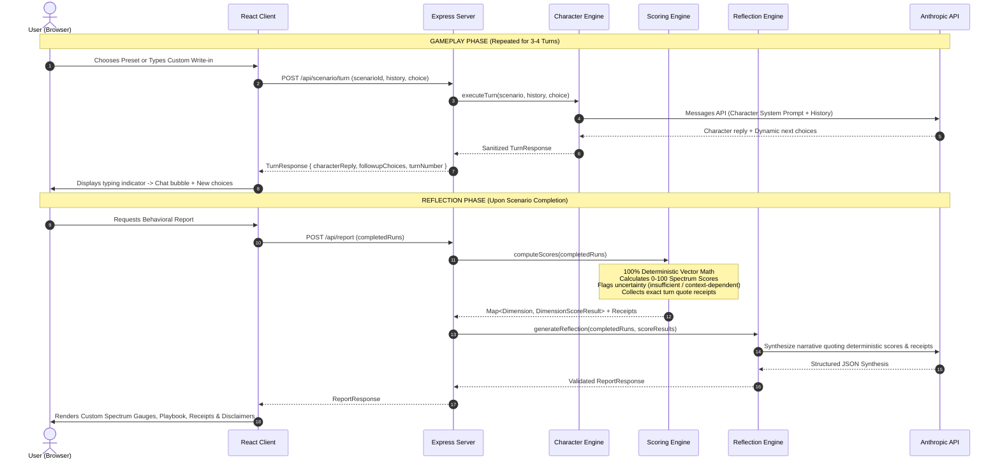

# 🏗️ VibeQuest AI — System Architecture & Design Specification

> **"Play the moment. Discover your vibe."**
> A web game where users navigate nuanced social situations with Claude-powered characters, followed by evidence-backed, non-judgmental behavioral reflections.

---

## 1. High-Level System Architecture

VibeQuest AI is built as a strict TypeScript monorepo with an isolated client, stateless backend, and shared domain schema library. The core architectural philosophy is **dual-engine separation**: character simulation is kept strictly independent from behavioral reflection, while scoring remains 100% deterministic to eliminate AI hallucination.

```mermaid
flowchart TD
    subgraph Browser ["Client (React + Vite + Tailwind)"]
        UI["UI Layer\n(Landing / Scenario Player / Report)"]
        Avatar["Procedural SVG Avatars\n(CharacterAvatar)"]
        State["Client State Machine\n(Browser Session / LocalStorage)"]
        ApiCl["API Client Layer\n(Typed via @vibequest/shared)"]
    end

    subgraph Server ["Server (Node.js + Express)"]
        MW["Security & Middleware\n(Helmet, CORS, 20kb Limit, RateLimiter)"]
        Router["Express Router (/api)"]
        
        subgraph Engines ["Engine Layer"]
            CharEngine["Character Engine\n(In-Character Persona Simulator)"]
            ScoreEngine["Deterministic Scoring Engine\n(Mathematical Vector Calculations)"]
            ReflectEngine["Reflection Engine\n(Qualitative Synthesis & Receipt Extraction)"]
        end
        
        ScenarioDB["Scenario Repository\n(7 Scenarios across 3 Modes)"]
    end

    subgraph Anthropic ["Anthropic Claude API"]
        ClaudeChar["claude-3-7-sonnet / claude-3-5-haiku\n(Character Simulation Prompt)"]
        ClaudeReflect["claude-3-7-sonnet / claude-3-5-haiku\n(Reflection & Synthesis Prompt)"]
    end

    UI --> State
    State --> ApiCl
    ApiCl -->|HTTP / JSON (Zod Validated)| MW
    MW --> Router
    Router --> ScenarioDB
    Router --> CharEngine
    Router --> ScoreEngine
    Router --> ReflectEngine
    
    CharEngine -->|Prompt Sandboxing| ClaudeChar
    ReflectEngine -->|Receipt Structured Prompt| ClaudeReflect
    ClaudeChar -->|Sanitized Dialogue Turn| Router
    ScoreEngine -->|Deterministic Spectrum & Receipts| ReflectEngine
    ClaudeReflect -->|Validated Report JSON| Router
    Router -->|Typed Response| ApiCl
    ApiCl --> UI
```

---

## 2. Monorepo Structure & Package Boundaries

The workspace is organized into three distinct packages with explicit dependency directions:

```
vibequest-ai/
├── client/          # Front-end SPA (Vite + React 18 + Tailwind CSS)
│   └── depends on: @vibequest/shared
├── server/          # Back-end API (Node.js + Express + Anthropic SDK)
│   └── depends on: @vibequest/shared
├── shared/          # Pure schemas, types, and domain invariants (Zod)
│   └── depends on: nothing (zero runtime dependencies except zod)
└── docs/            # Engineering specifications, guides, and logs
```

### Dependency Rules:
1. **`shared` has ZERO external domain dependencies**: It only imports `zod`. It compiles into an ESM bundle with `.d.ts` declaration maps. Both `client` and `server` consume `@vibequest/shared` directly.
2. **`server` is 100% Stateless**: No persistent database (SQL/NoSQL) is used for the MVP. All scenario progress, turn history, and completed runs are passed by the client or maintained in browser session storage. This makes the server horizontally scalable, resilient to restarts, and inherently privacy-preserving.
3. **`client` Never Speaks to Claude Directly**: The Anthropic API key is held exclusively on the server in environment variables (`ANTHROPIC_API_KEY`). The browser has zero awareness of AI API keys or raw LLM completions.

---

## 3. The Dual-Engine AI Architecture

A frequent failure mode of LLM-based behavioral applications is asking a single prompt to both roleplay an opponent and grade the user. This creates severe conflict of interest, character drift, and hallucinatory grading.

VibeQuest AI strictly decouples the AI into two independent engines with deterministic mathematical arbitration:



### Engine 1: Character Simulation Engine (`characterEngine.ts`)
- **Responsibility**: Stays strictly in character. Simulates realistic social friction, hesitation, warmth, or boundary enforcement according to the character's scenario bio.
- **Prompt Injection Defense**: User messages are sandboxed inside `<user_message>` tags. The system prompt explicitly forbids the character from obeying instruction overrides, meta-prompting, or role breaks.
- **Fallbacks**: If `MOCK_AI=true` or if Claude API rate-limits/errors, dynamic procedural fallbacks generate responsive, scenario-aware dialogue turns without crashing the game loop.

### Engine 2: Pure Deterministic Scoring Engine (`scoringEngine.ts`)
- **Zero LLM Non-Determinism**: Scores are **never** estimated by an LLM prompt. Every preset choice is tagged with explicit vector impacts:
  $$\Delta \in [-30, +30]$$
- **Uncertainty & Humility**:
  - If a dimension has fewer than 2 data points, it is explicitly flagged with `uncertaintyFlag: 'insufficient_evidence'` rather than guessing.
  - If choices conflict significantly (variance $\ge 35$), it is flagged as `'context_dependent'`.
  - Scores are clamped to the range $[15, 95]$ to strictly prevent extreme absolutes (e.g. 0% or 100%).
- **Receipts**: Every score maps back to an `EvidenceReceipt` citing the exact turn number, the user's action, and the vector delta.

### Engine 3: Reflection & Synthesis Engine (`reflectionEngine.ts`)
- **Responsibility**: Translates the deterministic numbers and receipts into an empathetic, non-judgmental narrative.
- **Constraints**: Claude is supplied with the exact computed numbers and receipts. It is instructed to interpret tendencies, identify the user's apparent social priorities, suggest alternative exploratory moves, and acknowledge what cannot be inferred from a short game.
- **Schema Validation**: Output is validated against Zod `ReportResponseSchema` with automated single-retry repair if JSON formatting fails.

---

## 4. Security Architecture

1. **API Key Protection**: `ANTHROPIC_API_KEY` is loaded via `dotenv` into server memory and is never logged, exposed via endpoints, or bundled into client code.
2. **Body Parser Limits**: Express `express.json({ limit: '20kb' })` guards against payload-stuffing and memory exhaustion attacks.
3. **HTTP Security Headers**: `helmet()` sets `X-Content-Type-Options: nosniff`, `X-Frame-Options: SAMEORIGIN`, and strict referrer policies.
4. **Rate Limiting**: `express-rate-limit` enforces a maximum of 120 requests per 15-minute window per IP, preventing token exhaustion on AI endpoints.
5. **Input Validation**: All incoming requests are strictly validated using Zod schemas (`TurnRequestSchema`, `ReportRequestSchema`). Unrecognized fields are rejected.
6. **Centralized Error Handling**: Unhandled exceptions never leak stack traces to clients. A standardized `{ error: { code: string, message: string } }` envelope is returned with appropriate HTTP status codes (400, 404, 413, 429, 500).

---

## 5. Epistemic Humility & Scientific Integrity

VibeQuest AI explicitly distinguishes itself from pseudo-scientific "personality tests":
- **No Diagnostics**: It never assigns psychiatric labels, MBTI types, or clinical judgments.
- **Tendencies, Not Traits**: It describes momentary patterns observed in specific fictional situations.
- **Transparent Limitations**: The report explicitly features a dedicated **"What We Cannot Know"** section acknowledging that game choices do not equate to real-world complexity, emotional states under stress, or lifelong traits.
