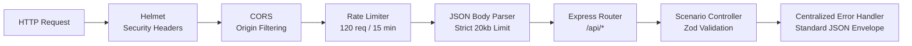

# ⚙️ VibeQuest AI — Backend Architecture & API Specification

> **Backend Philosophy**: A lean, stateless, hyper-secure Express API. It holds the Claude API credentials, validates every byte with Zod, and maintains strict separation between game simulation and deterministic scoring.

---

## 1. Middleware Pipeline & Security Stack

The Express app in `server/src/server.ts` configures a hardened HTTP pipeline:



### 1. `helmet()`
Sets strict HTTP headers to block XSS, clickjacking, and MIME sniffing (`X-Content-Type-Options: nosniff`, `X-Frame-Options: SAMEORIGIN`).

### 2. `cors()`
Restricts cross-origin requests to configured client domains (`CORS_ORIGIN` env, defaulting to `http://localhost:5173`).

### 3. `express-rate-limit`
Limits traffic to 120 requests per 15-minute window per IP to prevent API abuse and token exhaustion.

### 4. `express.json({ limit: '20kb' })`
Guards against JSON payload flooding attacks. Requests exceeding 20kb are rejected with HTTP 413.

---

## 2. API Endpoints Reference

### 1. Health Check
- **`GET /api/health`**
- **Response**: `200 OK`
```json
{
  "status": "ok",
  "service": "vibequest-ai-api",
  "version": "1.0.0",
  "timestamp": "2026-10-09T09:30:00.000Z"
}
```

### 2. Scenario Catalog
- **`GET /api/scenarios`**
- **Response**: `200 OK`
- Returns an array of `ScenarioDefinition` objects across all three modes (Social Simulator, Conflict Arena, Flirt Lab).

### 3. Advance Turn
- **`POST /api/scenario/turn`**
- **Request Body** (`TurnRequestSchema`):
```json
{
  "scenarioId": "social_dinner_bill",
  "turnHistory": [
    {
      "turnNumber": 1,
      "userChoice": { "id": "split_even", "text": "Sure, let's just split it equally.", "tone": "diplomatic" },
      "characterReply": "Maya smiles warmly: 'Awesome! Makes math so much easier.'"
    }
  ],
  "chosenOptionId": "itemized_split",
  "customWriteIn": null
}
```
- **Response**: `200 OK` (`TurnResponseSchema`)
```json
{
  "turnNumber": 2,
  "characterReply": "Maya pauses for a second, glancing at the bill. 'Oh, yeah totally! Whatever works for you!'",
  "followupChoices": [
    { "id": "ch_2_1", "text": "I can calculate my exact part right now.", "tone": "direct" },
    { "id": "ch_2_2", "text": "No worries, I'll just Venmo whatever you send.", "tone": "diplomatic" }
  ],
  "isFinalTurn": false
}
```

### 4. Behavioral Report Synthesis
- **`POST /api/report`**
- **Request Body** (`ReportRequestSchema`):
```json
{
  "completedRuns": [
    {
      "scenarioId": "social_dinner_bill",
      "turns": [ ... ]
    }
  ]
}
```
- **Response**: `200 OK` (`ReportResponseSchema`)
```json
{
  "summary": "Across interactions, you prioritize clear mutual expectations over unspoken assumptions...",
  "dimensions": {
    "directness_vs_diplomacy": {
      "score": 75,
      "label": "Direct Communicator",
      "uncertaintyFlag": "sufficient",
      "description": "Prefers addressing tension promptly with minimal sugarcoating."
    }
  },
  "strengths": ["Clarity under pressure", "Healthy boundary maintenance"],
  "blindSpots": ["Risk of being perceived as unyielding in low-stakes social contexts"],
  "observedPlaybook": [ ... ],
  "alternativeMoves": [ ... ],
  "evidenceReceipts": [ ... ],
  "whatWeCannotKnow": [ ... ]
}
```

---

## 3. Centralized Error Envelope

All API errors return a uniform schema:
```json
{
  "error": {
    "code": "INVALID_REQUEST",
    "message": "Field 'scenarioId' is required and cannot be empty.",
    "details": [ ... ]
  }
}
```

HTTP Status Codes used:
- `400 Bad Request`: Zod validation failure or malformed payload.
- `404 Not Found`: Unknown scenario ID requested.
- `413 Payload Too Large`: Request body exceeds 20kb limit.
- `429 Too Many Requests`: Rate limit exceeded.
- `500 Internal Server Error`: Unhandled server exception.
