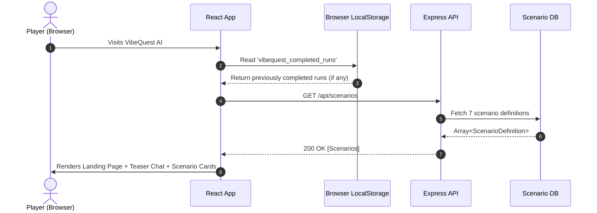
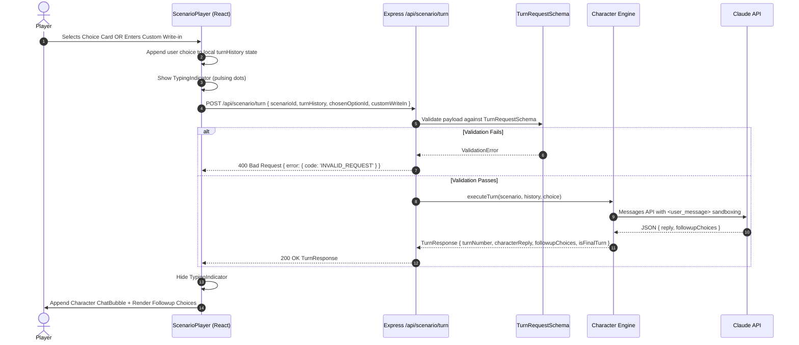

# 🔄 VibeQuest AI — End-to-End Data Flow Specification

> **Traceability Principle**: Every piece of data in the system has a single source of truth, an explicit schema validator, and a clear lifecycle from input to destruction.

---

## 1. Lifecycle Stage 1: Scenario Initialization



---

## 2. Lifecycle Stage 2: Turn Progression Loop

Repeats for 3 to 4 turns per scenario:



---

## 3. Lifecycle Stage 3: Scenario Completion & Run Persistence

When `turnNumber >= maxTurns` (or user clicks **End Dialogue**):
1. `ScenarioPlayer` packages the completed dialogue turns into a `SessionRun`:
   ```typescript
   interface SessionRun {
     scenarioId: string;
     scenarioTitle: string;
     mode: GameMode;
     turns: CompletedTurn[];
     completedAt: string;
   }
   ```
2. The run is appended to `completedRuns` array in React state.
3. React syncs the array to browser `localStorage.setItem('vibequest_completed_runs', ...)`.
4. The view returns to the Landing Page with an updated **"Generate Report (N Scenarios Played)"** button.

---

## 4. Lifecycle Stage 4: Report Synthesis Pipeline

```mermaid
flowchart TD
    RunData[Client completedRuns\nStored in Browser LocalStorage] -->|POST /api/report| APIEndpoint[/api/report]
    
    subgraph Server Processing
        APIEndpoint --> ZodVal[Zod Validation\nReportRequestSchema]
        ZodVal --> ScoreEng[Deterministic Scoring Engine\ncomputeScores]
        
        subgraph Mathematical Scoring
            ScoreEng --> Baseline[Base Score = 50]
            Baseline --> VectorSum[Sum Option Deltas\nper Behavioral Dimension]
            VectorSum --> Clamp[Clamp Scores to 15 - 95]
            VectorSum --> Uncertainty[Evaluate Uncertainty\ninsufficient_evidence if n < 2\ncontext_dependent if spread >= 35]
            VectorSum --> Receipts[Extract Turn Receipts\nQuote turn + action + delta]
        end
        
        ScoreEng --> ReflEng[Reflection Engine\ngenerateReflection]
        Receipts --> ReflEng
        
        subgraph AI Qualitative Synthesis
            ReflEng --> ClaudeReq[Anthropic API\nInject Numbers + Receipts\nEnforce Epistemic Humility]
            ClaudeReq --> ClaudeResp[Claude Output\nStructured JSON]
            ClaudeResp --> ZodRespVal[Zod Validation\nReportResponseSchema]
        end
        
        ZodRespVal --> OutEnvelope[Final Report Payload]
    end
    
    OutEnvelope -->|200 OK| ClientView[React ReportPage]
    ClientView --> Gauges[Spectrum Gauges & Meters]
    ClientView --> Playbook[Observed Playbook & Moves]
    ClientView --> ReceiptCards[Verbatim Evidence Receipts]
    ClientView --> Humility[What We Cannot Know Section]
```

---

## 5. Lifecycle Stage 5: Zero-Trace Data Erasure

When the user clicks **"Reset Session & Clear Data"**:
1. `localStorage.removeItem('vibequest_completed_runs')` executes immediately.
2. React state is reset to `[]`.
3. Because the server is entirely stateless (no user accounts, no database rows, no profiling tokens), all game session data ceases to exist instantly.
