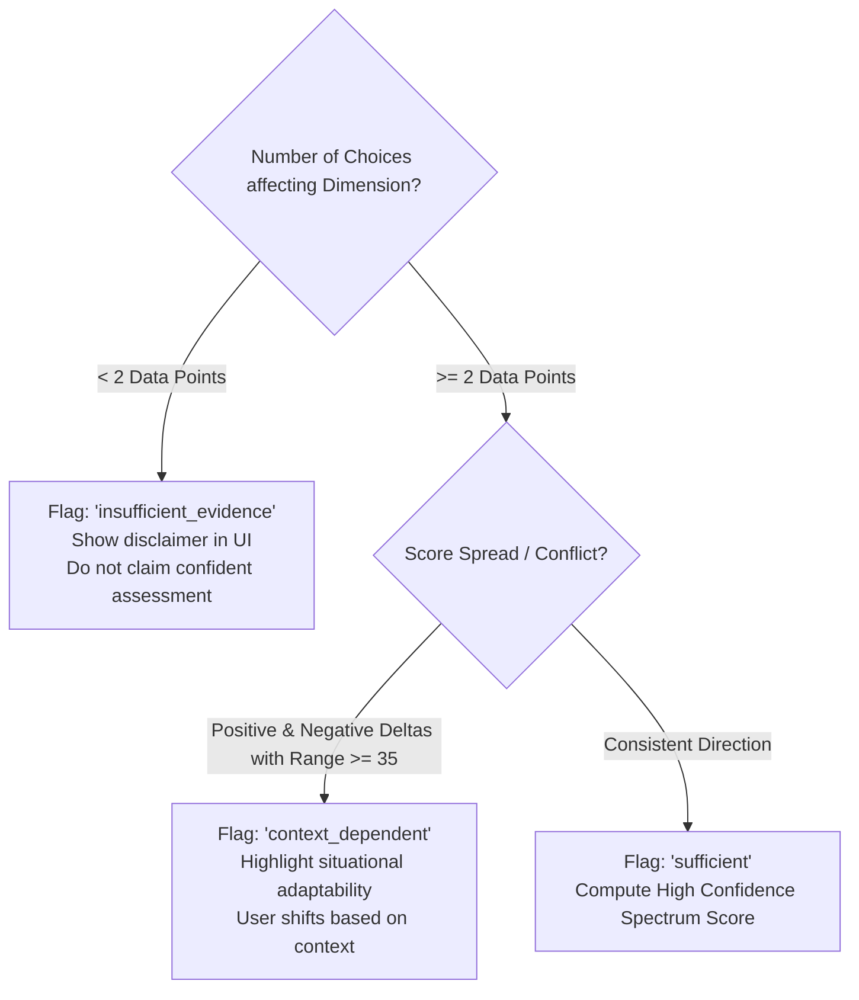

# 🎲 VibeQuest AI — Game Logic & Deterministic Scoring Mechanics

> **Core Philosophy**: Psychological insights in software must be grounded in mathematical transparency and verifiable receipts. No black-box scores, no random numbers, no pseudo-clinical archetypes.

---

## 1. The Five Behavioral Dimensions

Rather than rigid personality traits (like Introversion or Extraversion), VibeQuest AI evaluates five situational communication spectrums (0 to 100):

| Dimension Identifier | Low (0 - 40) | Midpoint (41 - 59) | High (60 - 100) |
| :--- | :--- | :--- | :--- |
| `directness_vs_diplomacy` | **Diplomatic / Indirect**<br>Prioritizes cushioning, social harmony, and gentle hinting. | **Balanced Communicator**<br>Adjusts bluntness based on conversational context. | **Direct / Candid**<br>Speaks plainly, cuts to the core issue, values unvarnished truth. |
| `speed_vs_deliberation` | **Deliberate / Patient**<br>Takes time to cool down, observe, and ponder consequences. | **Paced Responder**<br>Calibrates response timing to situational urgency. | **Immediate / Swift**<br>Acts in the moment, seeks rapid resolution, addresses tension on the spot. |
| `vulnerability_vs_containment` | **Contained / Guarded**<br>Keeps emotional cards close to chest, maintains composure. | **Selectively Open**<br>Shares vulnerability once mutual trust is signaled. | **Open / Transparent**<br>Shares genuine feelings, admits uncertainty or awkwardness openly. |
| `boundary_firmness` | **Flexible / Accommodating**<br>Yields ground to maintain rapport, adapts to others' demands. | **Negotiating**<br>Flexible on process, firm on core principles. | **Firm / Unyielding**<br>Sets crystal-clear limits, protects personal bandwidth without apology. |
| `playfulness_vs_gravity` | **Grave / Earnest**<br>Treats interactions with seriousness, precision, and focus. | **Adaptive Tone**<br>Blends humor with sincerity depending on interlocutor. | **Playful / Humorous**<br>Uses wit, tease, light banter, or levity to de-escalate tension. |

---

## 2. Mathematical Scoring Engine Formula

All scoring logic lives in `server/src/engines/scoringEngine.ts` as a pure, deterministic function.

### Vector Accumulation
Every scenario choice carries explicit mathematical impact deltas for relevant dimensions:
$$\Delta \in [-30, +30]$$

1. **Baseline**: Every dimension starts at a neutral baseline of $B = 50$.
2. **Summation**:
   $$\text{RawScore} = 50 + \sum_{i=1}^{n} \Delta_i$$
3. **Clamping Rule**:
   People are multi-faceted humans who cannot be reduced to 0% or 100% absolutes in a game. Scores are strictly clamped:
   $$\text{FinalScore} = \min(95, \max(15, \text{RawScore}))$$

---

## 3. Epistemic Uncertainty Handling

A critical differentiator of VibeQuest AI is admitting what the data does **not** support.



### The Three Uncertainty States:
1. `insufficient_evidence`: If a user only played a single turn that touched this dimension ($n < 2$), the system displays a clear warning: *"Limited sample size: Observed only 1 situational move."*
2. `context_dependent`: If a user made conflicting choices across turns (e.g., highly blunt in Turn 1, but highly diplomatic in Turn 3, with $|\Delta_{\max} - \Delta_{\min}| \ge 35$), the system does not average them into a misleading midpoint. Instead, it flags the user as context-sensitive, highlighting that they shift gears depending on the conversational partner.
3. `sufficient`: 2 or more consistent moves observed.

---

## 4. Evidence Receipts

Every insight produced by the report is directly backed by an immutable `EvidenceReceipt`:

```typescript
export interface EvidenceReceipt {
  turnNumber: number;
  scenarioTitle: string;
  userAction: string;
  dimension: BehavioralDimension;
  impactQuote: string;
}
```

When the report renders in the browser:
- The user can expand **"Observed Evidence Receipts"**.
- Each card shows the exact scenario, turn number, the verbatim choice or write-in text, and how that specific move influenced the spectrum.
- This creates total accountability: users see **why** the system made its observation.

---

## 5. Scenario Catalog (7 Scenarios across 3 Modes)

| Mode | Scenario ID | Title | Key Character | Core Conflict / Dynamics |
| :--- | :--- | :--- | :--- | :--- |
| **Social Simulator** | `social_dinner_bill` | The Group Dinner Check Split | **Maya** (Spontaneous, breezy) | Unequal orders, split-evenly expectation, financial boundary vs. group harmony. |
| **Social Simulator** | `social_friend_news` | The Overheard Secret | **Jordan** (Sensitive, anxious) | Hearing sensitive news second-hand, managing loyalty, timing disclosure. |
| **Conflict Arena** | `conflict_late_coworker` | The Deadline Crunch | **Leo** (Under-pressure colleague) | Unreliable teammate misses handoff, direct feedback vs. defusing panic. |
| **Conflict Arena** | `conflict_roommate_mess` | The Kitchen Cold War | **Marcus** (Defensive, busy) | Unaddressed household mess, boundary enforcement vs. passive-aggressive escalation. |
| **Conflict Arena** | `conflict_uninvited_guest` | The Plus-One Surprise | **Elena** (Boundary-pushing friend) | Unannounced companion brought to intimate dinner, boundary setting under social pressure. |
| **Flirt Lab** | `flirt_coffee_meet` | The Accidental Double Take | **Sam** (Charming barista) | Mutual interest signal, witty banter vs. direct romantic clarity. |
| **Flirt Lab** | `flirt_mixed_signals` | The Late Night Text | **Chloe** (Playful, enigmatic) | Ambiguous late-night banter, seeking clarity without killing playful spark. |
